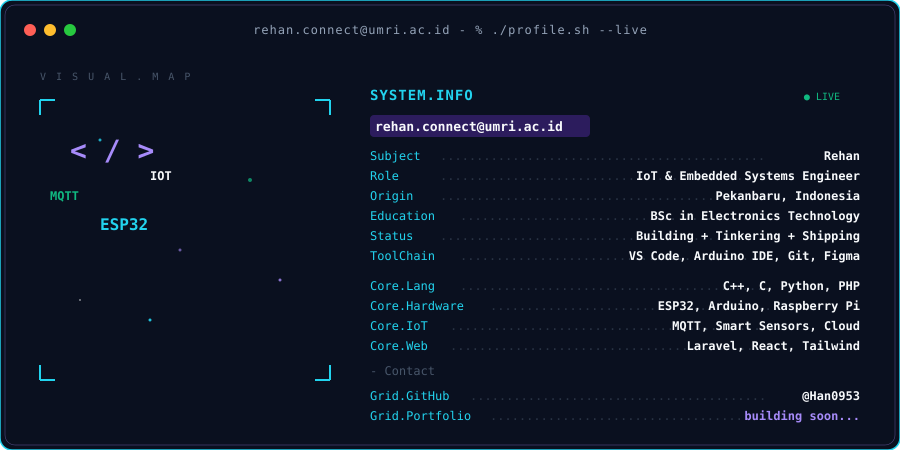
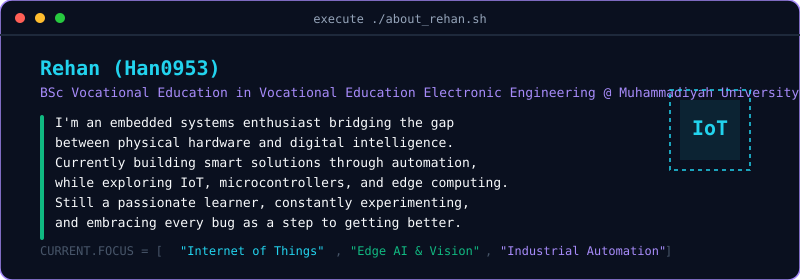
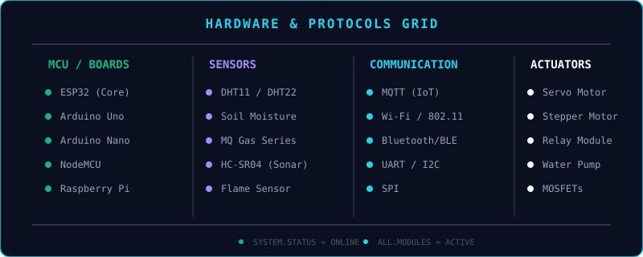

<!-- ======================================================== -->
<!--                     TERMINAL HEADER                      -->
<!-- ======================================================== -->

  <!-- Custom Terminal SVG -->
  <picture>
    <source media="(prefers-color-scheme: dark)" srcset="./dark.svg">
    <source media="(prefers-color-scheme: light)" srcset="./dark.svg">
    
  </picture>

    

  <!-- STATS GRID -->
  
  
   
  
  
  

    

  <!-- ======================================================== -->
  <!--                   TYPING TEXT ANIMATION                  -->
  <!-- ======================================================== -->
  

    

  <!-- ======================================================== -->
  <!--                 SYSTEM STATUS & BADGES                   -->
  <!-- ======================================================== -->
  
  <!-- System Visits / Profile Views -->
  
  &nbsp;
  <!-- C/C++ Badge -->
  
  &nbsp;
  <!-- Arduino Badge -->
  
  &nbsp;
  <!-- ESP32 Badge -->
  
  <!-- Fake System Status Badge for Aesthetic -->
  

<!-- Animated Glowing Cyber Line Divider -->

  

<!-- ======================================================== -->
<!--                        ABOUT ME                          -->
<!-- ======================================================== -->

  <picture>
    <source media="(prefers-color-scheme: dark)" srcset="./about.svg?v=1">
    <source media="(prefers-color-scheme: light)" srcset="./about.svg?v=1">
    
  </picture>

 

<!-- ======================================================== -->
<!--                   HARDWARE EXPERIENCE                    -->
<!-- ======================================================== -->

  <picture>
    <source media="(prefers-color-scheme: dark)" srcset="./hardware.svg">
    <source media="(prefers-color-scheme: light)" srcset="./hardware.svg">
    
  </picture>

<!-- Animated Glowing Cyber Line Divider -->

  

<!-- ======================================================== -->
<!--                      SNAKE ANIMATION                     -->
<!-- ======================================================== -->

  <!-- Note: Path ini tetep pake URL absolute karena beda branch (branch 'output') -->
  <picture>
    <source media="(prefers-color-scheme: dark)" srcset="https://raw.githubusercontent.com/Han0953/Han0953/output/github-snake-dark.svg" />
    <source media="(prefers-color-scheme: light)" srcset="https://raw.githubusercontent.com/Han0953/Han0953/output/github-snake.svg" />
    
  </picture>

 

<!-- ======================================================== -->
<!--                      CONNECT WITH ME                     -->
<!-- ======================================================== -->

  
  &nbsp;&nbsp;
  
  &nbsp;&nbsp;
  

 

  <h3 align="center">💡 <i>"Building intelligent systems that connect the physical and digital worlds."</i></h3>
  

